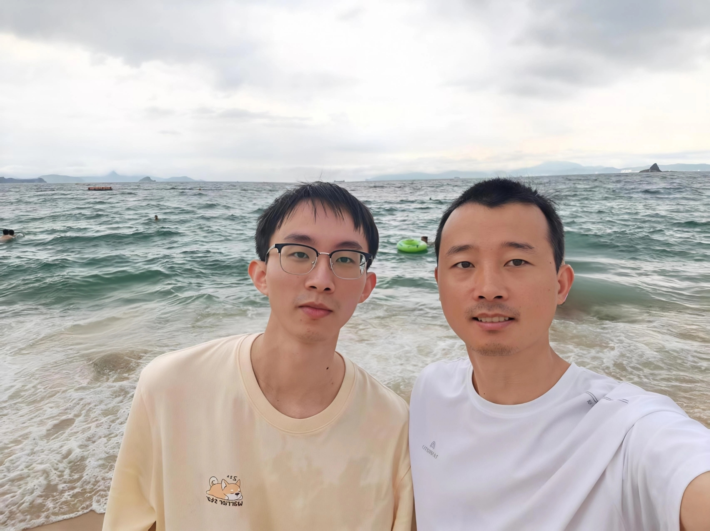

## 瞬间

> 捕捉生活中的光影与切片

  <button class="pw-filter active" data-view="time" type="button">时间</button>
  <button class="pw-filter" data-view="location" type="button">地点</button>

<section class="pw-group" data-location="深圳" markdown="1">
<h3><i class="fa-regular fa-calendar"></i> 2026年6月<i class="fa-solid fa-location-dot"></i> 深圳</h3>

</section>

<section class="pw-group" data-location="杭州" markdown="1">
<h3><i class="fa-regular fa-calendar"></i> 2026年5月<i class="fa-solid fa-location-dot"></i> 杭州</h3>

</section>

  

  <button class="pw-lightbox-btn pw-lightbox-close" id="pw-close" type="button" aria-label="关闭"><i class="fa-solid fa-xmark"></i></button>
  <button class="pw-lightbox-btn pw-lightbox-nav pw-lightbox-prev" id="pw-prev" type="button" aria-label="上一张"><i class="fa-solid fa-chevron-left"></i></button>
  <button class="pw-lightbox-btn pw-lightbox-nav pw-lightbox-next" id="pw-next" type="button" aria-label="下一张"><i class="fa-solid fa-chevron-right"></i></button>
  

    

    

      

      

      

        
<i class="fa-regular fa-calendar"></i>

        
<i class="fa-solid fa-camera"></i>

        
<i class="fa-solid fa-location-dot"></i>

      

    

  

