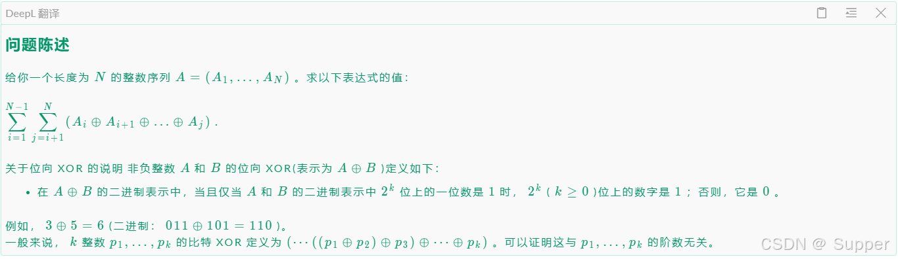
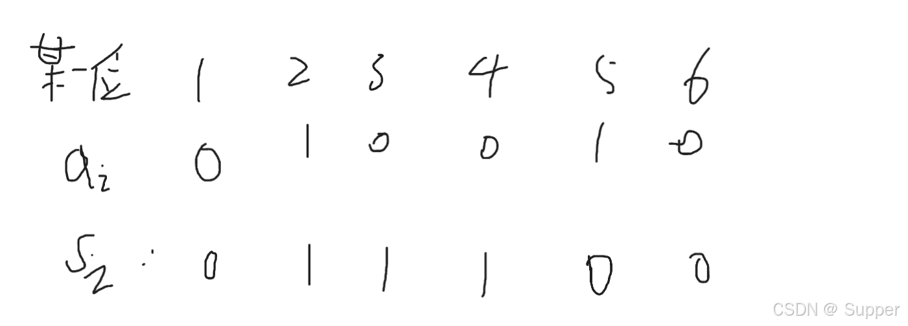
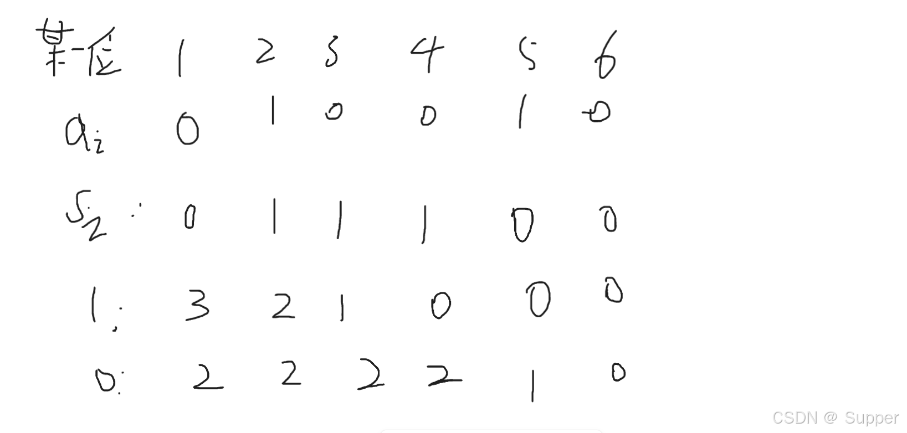
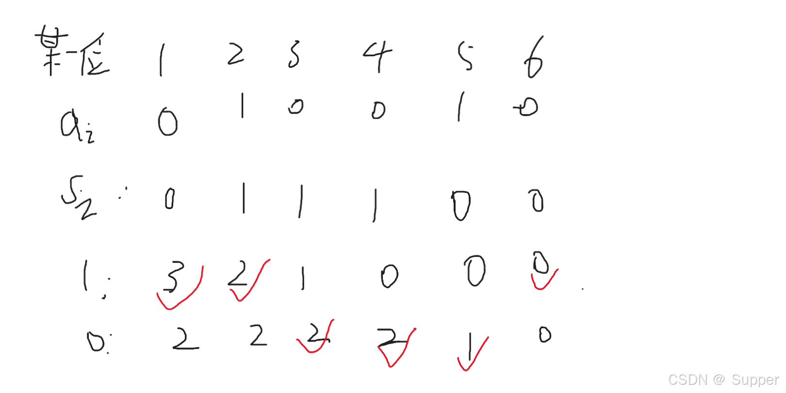

[Toyota Programming Contest 2024#8（AtCoder Beginner Contest 365）](https://atcoder.jp/contests/abc365)

# 写这篇题解主要是为了记录这种异或+位运算类型的题目，比较典，但自己这方面写的少，经验欠缺，来总结一下。
[E - Xor Sigma Problem](https://atcoder.jp/contests/abc365/tasks/abc365_e)

## 题目描述

## 解析：
**根据题意，我们可以想到异或对于每一位是独立的，因此我们可以拆开看每一位。因为异或本身的性质，有a ⊕ b ⊕ b = a,所以前缀异或是可行的。我们可以先求出来1~n的一个前缀异或，再进行后续的计算。**

## 思考：
**我们可以举例，比如对于某一位来讲，它的二进制为如图所示,a表示的是原数组，s表示前缀异或数组，这里只是取了其中的某一位，对其进行分析。**

**将问题拆开，其实就是对于一个[l,r]的序列，找到一段连续的区间(len > 2)，使得其区间异或的结果为1。因为结果为0的话，并不能对最终的这一位的结果产生影响。通过观察，我们可以发现这样的区间有：[1,2],[1,3],[1,4],[2,3],[2,4],[3,5],[3,6],[4,5],[4,6],[5,6]。OK，继续观察，看这些区间有什么样的性质。最直观的就是这些区间的异或和 为 1。我们得到了一个前缀异或数组，那能否将这些性质跟这个前缀异或数组产生联系呢？回想一下前缀异或的性质。Sr ⊕ Sl-1 = [l,r] 的异或值，对于数组中的任意一个下标元素，我们是否能找到符合条件的r呢？其实是可以的，我们只需要看i-1位置即可。例如我想看以3为起点的区间，那我就先知道2的Si，为1，通过Sr ⊕ Sl-1 = 1可知，Sr必然与Sl-1，也就是S2的值相反，所以我们只需要从3这个位置向后找，看哪个Si的值是0即可。
通过上述的分析可得。我们只需要预处理出某个下标，它之后的下标中S数组有多少个0,多少个1即可。然后根据Si-1的值，确定我们要取0的个数，还是1的个数。**

**这是统计好的0和1的个数，我们最终的所取的如下图所示，左边的1,0代表对应下标，其以后得位置中1,0出现的次数**

**到此，我们能够算出这一位有多少个区间，记为t，而这一位的答案就是t * 2^d,  d代表是第几位。只需要对每一位都进行这样的计算即可。代码如下：**

```cpp
#include <bits/stdc++.h>

using i64 = long long;
using PII = std::pair<i64,i64>;
#define int i64
#define yes std::cout << "YES\n";
#define no std::cout << "NO\n";

void solve() {
    int n;
    std::cin >> n;

    std::vector<int> a(n + 1);
    std::vector<int> s(n + 1);
    for (int i = 1; i <= n; i ++) {
        std::cin >> a[i];
        s[i] = s[i - 1] ^ a[i];
    }
    std::vector cnt(n + 10,std::vector<int>(2));
    int res = 0;
    for (int i = 30; i >= 0; i --) {
        int x1 = 0,x0 = 0;
        int t = 0;
        for (int j = n; j >= 1; j --) {
            cnt[j][0] = x0;
            cnt[j][1] = x1;
            if (s[j] >> i & 1) {
                x1 ++;
            } else {
                x0 ++;
            }
            t += cnt[j][(s[j - 1] >> i & 1) ^ 1];
        }
        res += (1 << i) * t;
        
    }
    std::cout << res << "\n";
}       

signed main() {
    std::ios::sync_with_stdio(false);
    std::cin.tie(nullptr); 
    
    int T = 1;
    
    // std::cin >> T;

    while (T -- ) {
        solve();
    }
    return 0;
}
```

# 另外，2023年蓝桥杯A组省赛也出过同样的题目，只不过多算了自身
[传送门](https://www.luogu.com.cn/problem/P9236)
**这道题的代码也可以过，不过需要多加几行，代码如下**

```cpp
#include <bits/stdc++.h>

using i64 = long long;
using PII = std::pair<i64,i64>;
#define int i64
#define yes std::cout << "YES\n";
#define no std::cout << "NO\n";

void solve() {
    int n;
    std::cin >> n;

    std::vector<int> a(n + 1);
    std::vector<int> s(n + 1);
    for (int i = 1; i <= n; i ++) {
        std::cin >> a[i];
        s[i] = s[i - 1] ^ a[i];
    }
    std::vector cnt(n + 10,std::vector<int>(2));
    int res = 0;
    for (int i = 30; i >= 0; i --) {
        int x1 = 0,x0 = 0;
        int t = 0;
        for (int j = n; j >= 1; j --) {
            cnt[j][0] = x0;
            cnt[j][1] = x1;
            if (s[j] >> i & 1) {
                x1 ++;
            } else {
                x0 ++;
            }
            t += cnt[j][(s[j - 1] >> i & 1) ^ 1];
        }
        for (int j = n; j >= 1; j --) {
            t += ((s[j] >> i & 1) ^ (s[j - 1] >> i & 1));
        }
        res += (1 << i) * t;
        
    }
    std::cout << res << "\n";
}       

signed main() {
    std::ios::sync_with_stdio(false);
    std::cin.tie(nullptr); 
    
    int T = 1;
    
    // std::cin >> T;

    while (T -- ) {
        solve();
    }
    return 0;
}
```
# 这种位运算+异或的题目比较典，遇到好几次了，从这次开始记录，希望看了此题解的小伙伴再遇到这种类型的题目都能做出来O(∩_∩)O~