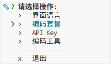
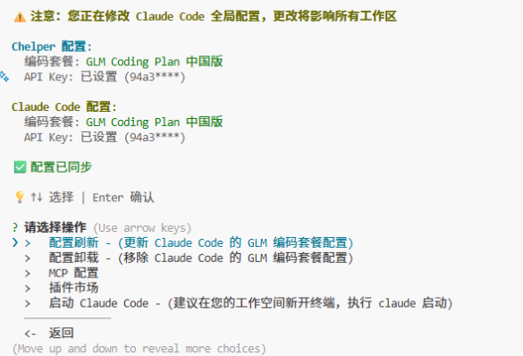
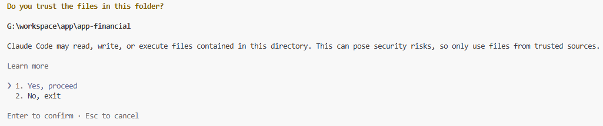
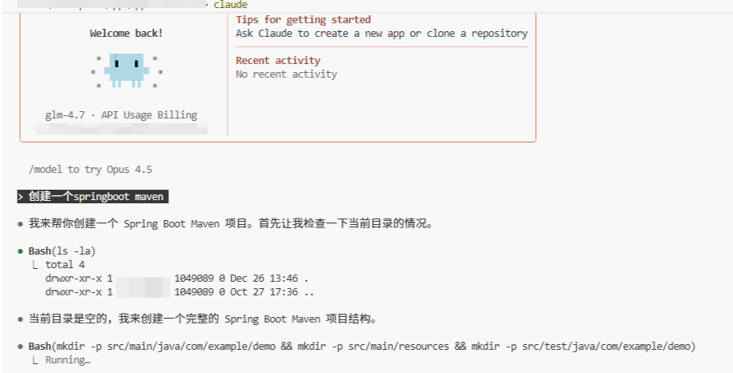

# Claude Code 使用分享文档

## 一、Claude Code 介绍

Claude Code 是 Anthropic 公司推出的一款 AI 驱动的编码助手工具，于 2025 年发布。它主要以命令行界面（CLI）形式存在，集成 Claude AI 模型（如 Claude 3.7 Sonnet），旨在帮助开发者通过自然语言交互加速软件开发过程。Claude Code 的核心功能包括：

- **代码理解与自动化**：它能扫描并理解整个代码库，提供上下文感知的建议，帮助处理调试、重构、代码生成等任务。
- **自然语言交互**：用户可以通过终端输入英文命令或描述需求，Claude Code 会生成代码片段或执行操作，而无需手动编写大量代码。
- **代理式（Agentic）能力**：支持工具集成，能自动化复杂工作流，如文件组织、API 调用或项目优化。
- **适用场景**：适合专业开发者，用于快速原型开发、代码审查或日常维护。它强调安全性、准确性和本地运行，减少对外部依赖。
- **优势亮点**：与其他 AI 工具不同，Claude Code 更注重“代理”模式，将手动编码视为备用方案，而非主要方式。它在终端中运行，兼容多种开发环境，且支持自定义配置。

在使用分享中，我发现 Claude Code 在处理大型代码库时特别高效，例如在调试遗留系统时，它能快速定位问题并建议修复路径。然而，它依赖于 Claude AI 的模型质量，对网络连接有一定要求。

## 二、在中国的使用对比：Claude Code vs Cursor vs Qoder 等工具

在中国境内使用 AI 编码工具时，需要考虑网络访问（防火墙影响）、数据隐私合规（GDPR 或中国数据安全法）、模型本地化支持、速度和成本等因素。以下对比 Claude Code 与 Cursor（AI 代码编辑器）、Qoder（Alibaba 的 AI IDE）等类似工具的优缺点。其他工具如 GitHub Copilot 或 Qwen Code（阿里云的编码模型）也可作为参考，但重点聚焦用户提及的工具。
### 2.1.从性能角度对比 Claude Code、Cursor 与 Qoder

| 维度                       | Claude Code                                                  | Cursor                                                       | Qoder                                                        |
| -------------------------- | ------------------------------------------------------------ | ------------------------------------------------------------ | ------------------------------------------------------------ |
| **响应速度（中国境内）**   | 较慢<br>依赖美国服务器，VPN 环境下平均响应时间 2-6 秒，网络波动时可达 10+ 秒 | 中等<br>同样依赖海外 API（OpenAI/Claude），VPN 下响应 1-4 秒，偶有超时 | 最快<br>国内服务器，直连环境下响应通常在 0.5-2 秒，峰值期也很少超过 3 秒 |
| **上下文处理能力**         | 优秀<br>代理模式下可完整理解大型代码库（数十万行），上下文窗口大，规划能力强 | 良好<br>IDE 内上下文感知强，但对超大项目有时需手动指定文件，偶尔丢失上下文 | 优秀<br>项目级持久记忆机制，对大规模代码库理解深度接近 Claude Code |
| **代码生成准确率与幻觉率** | 高<br>Claude 3.7 Sonnet 模型逻辑严谨，幻觉较少，重构建议可靠 | 中等偏上<br>依赖模型版本，Claude 模型时较好，GPT-4o 时偶有“创意”错误 | 中等偏上<br>Qwen-Max 在通用代码上表现优秀，但极复杂算法或冷门框架时偶有偏差 |
| **批量任务执行性能**       | 强<br>CLI 代理模式可一次性完成多文件重构、测试生成等复杂任务，自动化程度高 | 中等<br>多文件操作需逐个确认，批量重构效率较低               | 强<br>代理式工作流支持一键执行多步任务（如生成代码+单元测试+文档） |
| **资源占用**               | 低<br>纯 CLI，几乎不占本地 CPU/GPU，内存占用 < 200MB         | 高<br>基于 Electron 的 VS Code 分支，常驻内存 1-2GB，GPU 加速时更占资源 | 中等<br>独立 IDE，内存占用约 800MB-1.5GB，本地模型可选时可降低云端依赖 |
| **高峰期稳定性**           | 一般<br>海外服务在中国晚高峰或节假日易出现限流或连接不稳     | 一般<br>同海外服务问题，2025 年多次出现 API 限流             | 高<br>国内服务，受中国用户高峰影响较小，稳定性明显优于海外工具 |

**性能小结**：  
在中国境内实际使用时，**Qoder 的整体性能体验最优**，响应快、稳定、不卡顿。Claude Code 在单次任务的深度与准确性上领先，但受网络限制，实际流畅度打折扣。Cursor 性能居中，但资源占用最高，不适合配置较低的开发机。

### 2.2、从使用便利性角度对比

| 维度                  | Claude Code                                                  | Cursor                                                       | Qoder                                                        |
| --------------------- | ------------------------------------------------------------ | ------------------------------------------------------------ | ------------------------------------------------------------ |
| **部署与启动难度**    | 中等<br>需安装 CLI + 配置 API Key + 稳定 VPN，初始配置约 10-15 分钟 | 较低<br>下载安装包即用，可选模型配置简单，但需 VPN           | 最低<br>国内官网一键下载/安装，支持微信/支付宝登录，无需科学上网 |
| **中文支持程度**      | 一般<br>模型支持中文，但官方文档、提示词模板以英文为主，交互推荐用英文 | 一般<br>界面中英文混搭，AI 交互支持中文但效果不如英文        | 优秀<br>全中文界面、文档、提示词模板，AI 交互对中文需求理解最自然 |
| **学习曲线**          | 较高<br>CLI 操作 + 代理式思维，需要理解“委托任务”而非“逐行补全”的新范式 | 较低<br>类似传统 IDE + Copilot，上手最快，适合习惯 VS Code 的开发者 | 中等<br>界面友好，但代理式功能需稍许学习，官方有大量中文教程 |
| **与现有工作流集成**  | 高<br>纯终端工具，可无缝嵌入 Vim/Neovim/Tmux 等极客工作流    | 高<br>直接替代 VS Code，插件生态最丰富                       | 中等<br>独立 IDE，暂不支持 VS Code 插件市场，但支持导入项目  |
| **多设备/多环境切换** | 方便<br>只需 CLI + 配置同步，云端上下文一致                  | 一般<br>设置同步需账号登录，跨设备有时配置不一致             | 方便<br>支持云端项目同步，国内多端登录体验流畅               |
| **日常使用中断频率**  | 高<br>VPN 掉线、网络抖动会导致任务中断，需要重新描述上下文   | 中等<br>网络问题同上，但 IDE 内可离线编辑                    | 极低<br>直连服务，几乎无中断，适合长时间专注开发             |
| **企业合规与审核**    | 困难<br>代码上传海外，涉及数据出境，多数金融/国企无法直接使用 | 困难<br>同上，隐私与合规风险高                               | 简单<br>数据留在国内，易通过企业安全审核                     |

**便利性小结**：  
- **Claude Code** 适合追求极致自动化能力的专业开发者，但在中国使用门槛较高，日常体验易被网络打断。  
- **Cursor** 上手最快、生态最熟，但同样受网络与隐私限制，便利性在国内场景下大打折扣。  
- **Qoder** 在中国环境下的综合便利性最高：无需 VPN、全中文、无中断、合规友好，是最“开箱即用”的选择。

### 2.3 Claude Code 在中国的优缺点
- **优点**：
  - 强大的上下文理解和代理能力，能处理复杂任务如代码重构或自动化脚本生成。
  - 集成 Anthropic 的安全 AI 模型，减少幻觉（hallucination）问题，适合企业级开发。
  - CLI 形式轻量，便于集成到现有工作流中，无需切换 IDE。
- **缺点**：
  - 依赖海外服务器（Anthropic 位于美国），在中国需 VPN 访问，可能导致延迟或不稳定。
  - 数据隐私风险：上传代码库到云端可能违反中国数据本地化要求。
  - 成本较高（订阅模式），且中文支持有限，主要依赖英文交互。
  - 防火墙问题：频繁访问 API 可能被阻挡，影响实时使用。

### 2.4 Cursor 在中国的优缺点
Cursor 是一个基于 VS Code 分支的 AI 代码编辑器，集成 OpenAI 或 Claude 模型，提供代码补全、生成和调试功能。

- **优点**：
  - IDE 集成紧密，支持 GUI 操作，适合初学者或前端开发。
  - 模型选择灵活（如 Claude 3.5 Sonnet），代码生成速度快，能处理 GUI 相关任务。
  - 在中国有镜像或代理支持，部分用户通过国内 CDN 访问，延迟较低。
- **缺点**：
  - 同样依赖海外 API（如 OpenAI），需 VPN，防火墙问题突出。
  - AI 行为有时不稳定，可能生成错误代码或影响性能（“code on LSD”现象）。
  - 隐私担忧：代码上传到云端，合规性差；此外，2025 年曝出安全漏洞，可能允许无声代码执行。
  - 学习曲线陡峭，对于非程序员用户，过度依赖 AI 可能导致技能退化。

### 2.5 Qoder 在中国的优缺点
Qoder 是阿里巴巴推出的代理式 AI IDE，专注于真实软件开发，支持代码理解、文档生成和测试。

- **优点**：
  - 中国本土工具，无需 VPN，访问稳定，服务器位于国内，延迟低。
  - 深度项目理解和持久记忆功能，适合大规模代码库；集成 MCP 工具，支持中文交互。
  - 免费预览模式，成本低；合规性强，符合中国数据安全法，无跨境数据传输风险。
  - 代理能力强，能处理从编码到测试的全流程，2025 年被誉为“游戏改变者”。
- **缺点**：
  - 作为新兴工具（2025 年发布），成熟度不如 Claude Code 或 Cursor，功能可能不全。
  - 模型（如 Qwen）在复杂逻辑上偶有局限，需用户干预。
  - 生态依赖阿里云，可能不兼容其他云服务；UI 偏向专业开发者，不够直观。

### 2.6 整体对比总结表

| 工具                          | 中国访问便利性     | 隐私与合规         | 功能深度         | 成本与稳定性   | 适用人群             |
| ----------------------------- | ------------------ | ------------------ | ---------------- | -------------- | -------------------- |
| **Claude Code**               | 低（需 VPN）       | 中（海外数据风险） | 高（代理自动化） | 中高（订阅）   | 专业开发者           |
| **Cursor**                    | 中（部分代理支持） | 低（漏洞历史）     | 中（IDE 集成）   | 中（订阅）     | 初级到中级 coder     |
| **Qoder**                     | 高（本土）         | 高（本地化）       | 高（项目理解）   | 低（免费预览） | 中国开发者，企业用户 |
| **其他（如 GitHub Copilot）** | 低（需 VPN）       | 中                 | 中（补全为主）   | 中             | 通用                 |

在中国，Qoder 等本土工具在访问和合规上占优，而 Claude Code 和 Cursor 在功能创新上领先，但受网络限制。用户可根据项目规模选择：小型项目用 Cursor，复杂开发用 Claude Code，企业级用 Qoder。

## 三、总结

Claude Code 作为一款创新的 AI 编码助手，在提升开发效率方面表现出色，尤其适合需要深度自动化和上下文理解的场景。在中国境内使用时，它的优势在于代理能力和安全性，但缺点主要源于网络壁垒和隐私问题。与 Cursor（更注重 IDE 体验）和 Qoder（本土优化）相比，Claude Code 更适合有 VPN 条件的专业用户，而 Qoder 是中国开发者的首选，能规避跨境挑战。总体而言，选择工具需权衡访问便利性和功能需求；未来，随着本土 AI 进步，如 Qoder 的迭代，海外工具的竞争力可能减弱。建议结合实际测试，选择最匹配的组合以最大化生产力。


## 四、国内最佳实践
### 4.1 安装claude code

您需要安装 Node.js 18 或更新版本环境

Windows 用户还需安装 Git for Windows

进入命令行界面，安装 Claude Code

npm install -g @anthropic-ai/claude-code

运行如下命令，查看安装结果，若显示版本号则表示安装成功

claude --version


### 4.2. 配置 code-helper和套餐

- 使用自动化配置助手

```bash
# 进入命令行界面，执行如下运行 Coding Tool Helper 
npx @z_ai/coding-helper
```

详细说明请参考 [Coding Tool Helper 文档](https://docs.bigmodel.cn/cn/coding-plan/extension/coding-tool-helper)。

- 设置界面语言
- 设置编码套餐(我的是国内套餐)
- 设置API key
- 设置编码工具(Claude Code)
- 在terminal中执行claude启动 claude Code 编码工具










- 使用最新默认映射 `C:\Users\Administrator.claude\settings.json` 配置

```json
{
  "env": {
    "ANTHROPIC_AUTH_TOKEN": "glm4.7 key",
    "ANTHROPIC_BASE_URL": "https://open.bigmodel.cn/api/anthropic",
    "API_TIMEOUT_MS": "3000000",
    "CLAUDE_CODE_DISABLE_NONESSENTIAL_TRAFFIC": 1,
    "ANTHROPIC_DEFAULT_HAIKU_MODEL": "glm-4.5-air",
    "ANTHROPIC_DEFAULT_SONNET_MODEL": "glm-4.7",
    "ANTHROPIC_DEFAULT_OPUS_MODEL": "glm-4.7"
  }
}
```

- 重新进入vs code 后在terminal中输入claude



